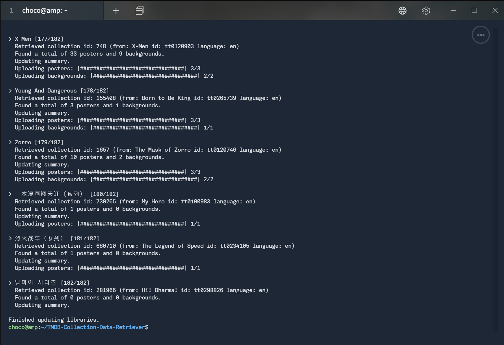

# TMDB Collection Data Retriever

This script collects metadata (summary and images) for your plex collection that were created based on TheMovieDB. This fork fixed `Invalid collections/does not match with TMDB collection` issue.

**How does it work?**

The script collects all collections from your movie library that do not have a summary yet. It does this by looking the movies within the collection. The movies have a reference to the collection on TheMovieDB. If a valid collection reference can be found it will pull the summary as well as download posters/background images (and use the same web calls as if you were manually updating it over the web interface).

A sample on a small test library looks like this:



**Attention**

Currently this has only been tested with a couple of libraries, so I would recommend to do a database backup before starting the process (even though I don't think the script can do any real harm).

# Installation

### Step 1 - Download/Clone GIT

Download/Clone this Git with command below:

```
sudo apt install git
sudo git clone https://github.com/chocolateshirt/TMDB-Collection-Data-Retriever.git
```

### Step 2 - Install PIP and python requirements

The following additional python libraries are used `requests`, `plexapi`, `progress`. Install it with PIP.

```
sudo apt install python3 python3-pip
sudo python3 -m pip install requests
sudo python3 -m pip install plexapi
sudo python3 -m pip install progress
```

### Step 3 - Configuration

Add your server ip and your plex token to the setting.ini

https://support.plex.tv/articles/204059436-finding-an-authentication-token-x-plex-token/

Additionally you can:
1. enable/disable the preference to prefer local art (if you have a non english library and want to get images in that langauge)
2. change the limit of posters/backgrounds you want to download


## Requirements

Python 3 (tested with 3.8.5)
